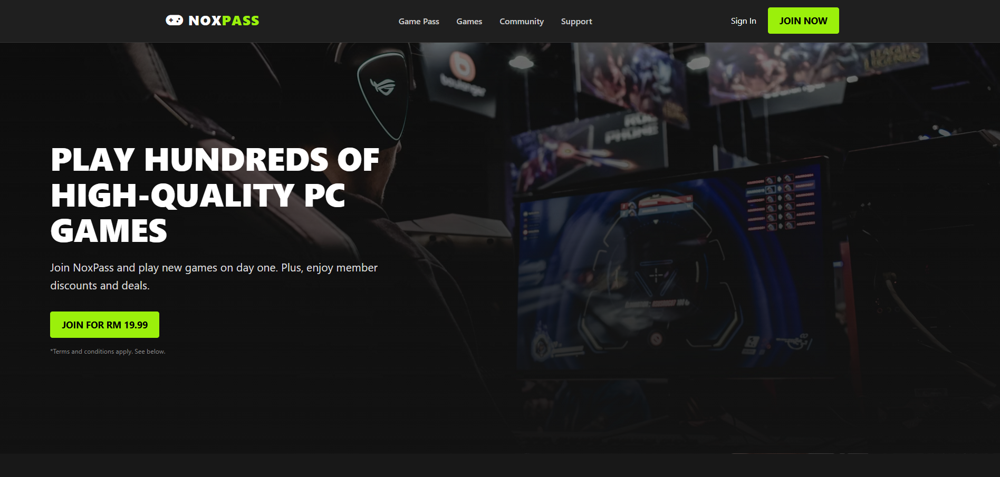
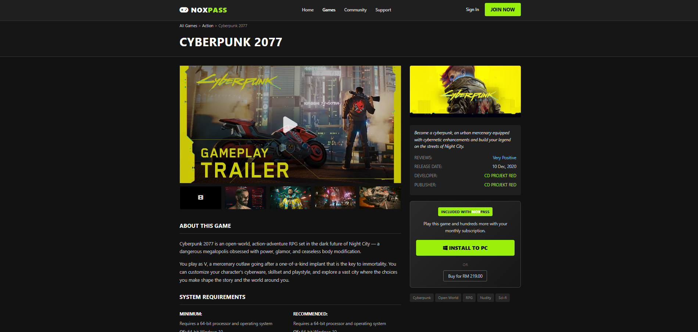
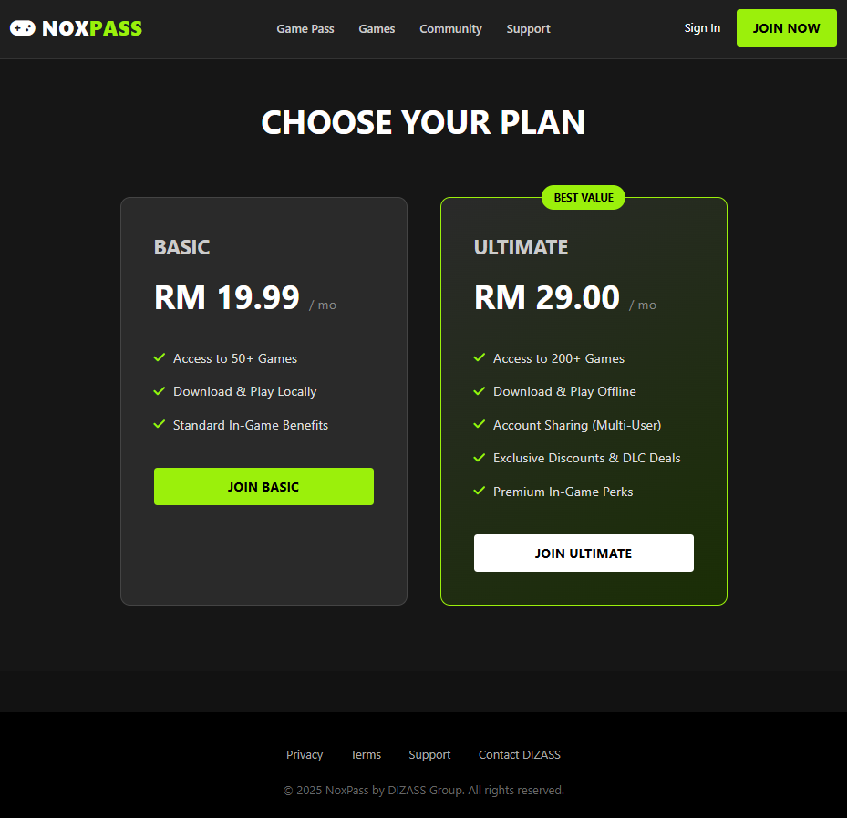

# 🎮 NoxPass - PC Game Subscription Service

 
*(Note: You can replace the image path above with a screenshot of your homepage later)*

## 📖 About The Project
**NoxPass** is a web-based e-commerce platform designed to simulate a digital PC game subscription service (similar to Xbox Game Pass). This project was developed as part of the **ICT552 (E-Commerce Technology)** group assignment at **UiTM Cawangan Kelantan, Kampus Machang**.

The platform allows users to browse a library of high-quality PC games, choose subscription plans, and simulate the downloading process.

**Group Name:** DIZASS  
**Course Code:** ICT552  
**Session:** Oct 2025 - Feb 2026

---

## 👥 Team DIZASS

| Name | Role | Matric No. |
| :--- | :--- | :--- |
| **Tengku Ahmad Danial** | Project Manager (Team Leader & Developer) | 2025197383 |
| **Mohamad Nur Ikhmal** | Marketing Manager | 2025142579 |
| **Muhammad 'Athif Dzikri** | Financial Manager | 2025395517 |
| **Muhammad Syafiq Ikhwan** | Technical & Platform Manager | 2024353053 |
| **Amier Zhafran** | Product Manager | 2025179869 |
| **Nur Shafiqriz** | Customer Relations & Support | 2024740797 |

---

## ✨ Key Features

* **Responsive Homepage:** Modern "Dark Mode" aesthetic with a hero banner and feature highlights.
* **User Authentication:** * Toggle between **Login** and **Sign Up**.
    * Role selection: **Customer**, **Developer**, or **Admin** (Login only).
    * Integrated FontAwesome icons in input fields.
* **Game Library:** * Grid view of game covers.
    * **Search Bar** and **Genre Filter** functionality.
    * Download buttons with login validation.
* **Subscription Plans:** Clear comparison between **Basic** and **Ultimate** plans.
* **Support Center:** FAQ section and a Contact Form.
* **Community Hub:** Landing page redirecting to the official Discord server.
* **Legal Pages:** Privacy Policy and Terms & Conditions.

---
 
## 🛠️ Technologies Used

* **HTML5** - Semantic structure.
* **CSS3** - Custom styling, Flexbox/Grid, and responsive design.
* **JavaScript** - Form validation, login simulation, and smooth scrolling.
* **Font Awesome 6** - UI Icons.

---

## 🚀 How to Run

1.  **Clone the repository** (or download the ZIP file):
    ```bash
    git clone [https://github.com/your-username/noxpass.git](https://github.com/your-username/noxpass.git)
    ```
2.  **Navigate to the folder:**
    ```bash
    cd noxpass
    ```
3.  **Open the project:**
    * Simply double-click `index.html` to open it in your web browser.
    * *Recommended:* Use "Live Server" extension in VS Code for the best experience.

---
 
## 📂 Project Structure

```text
noxpass/
│
├── images/             # Stores game covers, backgrounds, and logo
├── index.html          # Homepage
├── login.html          # Login & Sign Up Page
├── games.html          # Game Library & Search
├── support.html        # FAQ & Contact Form
├── contact.html        # Group Info & HQ Details
├── community.html      # Discord Redirect Page
├── privacy.html        # Privacy Policy
├── terms.html          # Terms & Conditions
├── style.css           # Main Stylesheet

└── README.md           # Project Documentation
